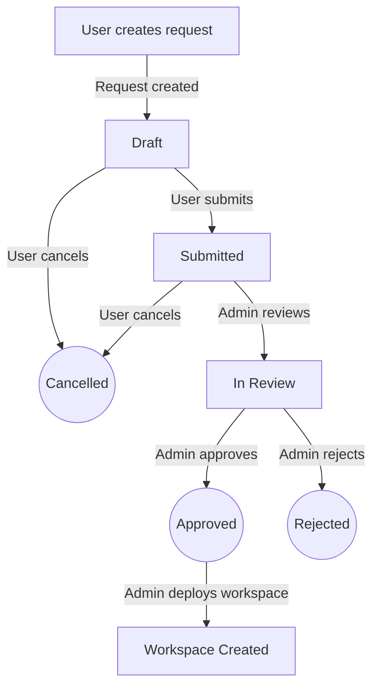

# Workspace Requests

The workspace request feature provides a formal approval workflow for TRE Users to request new workspaces. Instead of requiring a TRE Admin to directly create workspaces, users can submit requests that go through a review and approval process, creating an audit trail for all workspace provisioning decisions.

This feature is gated behind the `WORKSPACE_REQUESTS_ENABLED` configuration flag (default: `false`). See [Environment Variables](../tre-admins/environment-variables.md) for details on enabling it.

## Overview

The workspace request workflow allows:

- **TRE Users** to create, submit, and cancel workspace requests
- **TRE Admins** to review (approve/reject) requests and deploy approved workspaces
- An **audit trail** of all requests, reviews, and decisions
- **Template-driven forms** where template authors control which fields appear in the request form via the `show_in_request` attribute

## Request Lifecycle

A workspace request follows a state machine with six possible states:

1. **Draft** — The request has been created but not yet submitted. The requestor can edit, submit, or cancel it.
2. **Submitted** — The request has been submitted for review. The requestor can still cancel it. An admin can begin reviewing it.
3. **In Review** — An admin is actively reviewing the request. The admin can approve or reject it.
4. **Approved** — The request has been approved. A TRE Admin can now deploy the workspace using the standard workspace deployment form.
5. **Rejected** — The request has been rejected by an admin, with an explanation provided.
6. **Cancelled** — The requestor cancelled the request before it was reviewed.

!!! note
    When an admin initiates a review on a **Submitted** request, the system automatically transitions it to **In Review** before applying the approval or rejection decision.

## API Endpoints

The workspace requests API is available under `/api/workspace-requests`:

| Method | Endpoint | Role | Description |
| ------ | -------- | ---- | ----------- |
| `POST` | `/api/workspace-requests` | TREUser | Create a draft workspace request |
| `GET` | `/api/workspace-requests` | TREUser/TREAdmin | List workspace requests (scoped by role) |
| `GET` | `/api/workspace-requests/{id}` | TREUser/TREAdmin | Get workspace request details (ownership enforced) |
| `POST` | `/api/workspace-requests/{id}/submit` | TREUser | Submit request for approval |
| `POST` | `/api/workspace-requests/{id}/cancel` | TREUser | Cancel a draft or submitted request |
| `POST` | `/api/workspace-requests/{id}/review` | TREAdmin | Approve or reject a request |

### Authorization

- **TRE Users** can only view, submit, and cancel their own requests.
- **TRE Admins** can view all requests and perform reviews.
- Ownership checks are enforced on all user-facing endpoints — attempting to access another user's request returns HTTP 403 Forbidden.

## Data Storage

Workspace requests are stored in the shared **Requests** Cosmos DB container (the same container used by Airlock requests). Each workspace request document includes a `resourceType` field set to `workspace_request` to distinguish it from other request types.

## Template `show_in_request` Attribute

Template authors can mark specific properties in their `template_schema.json` with `"show_in_request": true`. These fields will appear in the workspace request form when a user selects that workspace type, allowing requestors to specify key workspace configuration options upfront.

For more details on using this attribute, see [Authoring Workspace Templates](../tre-workspace-authors/authoring-workspace-templates.md#show_in_request-attribute).

## Deployment

When a workspace request is approved, the TRE Admin can deploy the workspace directly from the request detail view using the **"Deploy Workspace"** button. This opens the standard workspace deployment form (the same form used for `POST /workspaces`), pre-selecting the requested workspace template. The admin can review and adjust all template parameters before deploying.

This ensures that workspace deployment follows the existing `POST /workspaces` flow — no duplicate deployment mechanism is introduced.
